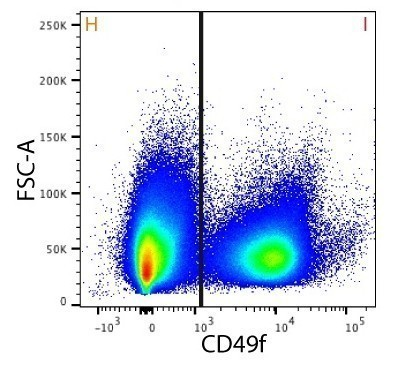
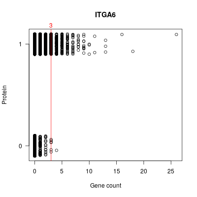
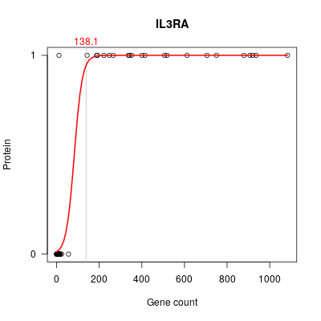

# scBin

scBin (**s**ingle-**c**ell RNA-seq data **Bin**arizer) plots a chosen gene's counts and determines a cutoff that is used for binarizing the data.

Please note that this package is **under development.**


## Background

Investigations often require that we determine presence or absence of expression of genes in a sample, as opposed to differentially expressed genes in relation to another sample or condition. This context-free perspective of gene expression requires a tool that classifies each gene's expression in a single cell or a cell type as 'not expressed' (0) or as 'expressed' (1). To determine this, we use a gene for which we have protein expression information (e.g. a flow cytometry marker). This solution therefore requires that we have sequenced at least one positive and one negative population for that gene, and also works under the somewhat strong assumption that mRNA numbers for all other genes will have similar effect as for the reference gene. A key factor in the efficiency of the method is the accuracy of the protein annotation, i.e. the positive and negative (flow sort) populations should be well-separated. Also important to note that the method does not demonstrate the _absence_ of gene expression.


## Method

Two methods are implemented currently: the true negative rate and the logit method.

If we know true expression of the flow marker gene for each cell, then we can build a confusion matrix (contingency table) and calculate a cutoff for given _true negative rate_ (TNR, specificity/SPC; 95% default). The cutoff is calculated for _nonzero_ samples. TNR was chosen from the statistical measures of the confusion matrix, to ensure high reliability of the expression calls.

For non-UMI data, the _logit method_ builds a logistic model from the flow marker gene count numbers and protein expression. A probability cutoff is then used to classify gene expression. Note that the low count numbers and the presence of many dropouts in droplet methods make it hard to build a useful model for UMI data.


## Example (UMI)

The UMI example data has 21623 cells (and 23310 genes) isolated from skin dermis. CD49f (ITGA6) was used to separate the endothelial cells (I) from the fibroblasts (H), and this will be used to classify the rest of the genes.



Load data and metadata:
```R
library("scBin")
library("Matrix")
x <- readMM("counts.txt")
colnames(x) <- scan("counts.colnames.txt", what = character())
rownames(x) <- scan("counts.rownames.txt", what = character())
x <- t(x)
meta <- read.delim("metadata.txt", stringsAsFactors = F, header = T, row.names = 1)
```

The metadata dataframe (`meta`), must have a binary vector column of flow (protein) sorting bins, used for the classification.

```R
meta$itga6 <- meta$Flow == "CD49f_positive"
meta$itga6 <- as.integer(meta$itga6)
markers <- list(c("ITGA6", "itga6"))
```

Data rows: cells, columns: genes.

```R
scplot.x <- scPlot(x, meta, markers, tnr = 0.95, jitter = T)
scplot.x$confusion
#   protein
#    FALSE  TRUE
#  0  8352 12980
#  1     1   290
scplot.x$plots
```



The calculated cutoff ('3') is shown in red. Note that the confusion matrix is calculated from _all_ samples, after applying the cutoff. As only the nonzero samples were used for calculating specificity, the specificity in the confusion matrix is much higher than the set specificity value. This ensures that we have high confidence in our expression calls. Binarize data:

```R
bin.matrix <- scBinarizer(x, cutoff = scplot.x$cutoff)
```

The binarized data can be used either for a new analysis of cells; or for augmenting cell annotations to decide which genes are expressed in each cell type.


## Example II

This example data contains 70 minibulk samples, each prepared from 500 myeloid cells. One of the flow sort markers was CD123 (IL3RA), and we use this for binarizing the data.

Load data and metadata:

```R
library("scBin")
markers <- list(c("IL3RA", "CD123"))

scplot.counts <- scLogit(counts, metadata, markers, prob = 0.95)
scplot.counts$plots
```



```R
bin.matrix <- scBinarizer(counts, scplot.counts$cutoff, logit = T)
```
